# Group Assignment 2

This assignment will give you the opportunity to experience packet sniffing and how it can be used to analyze network traffic and capture information.

> **WARNING**
>
> Even something as simple as a port scan can be considered unauthorized access to a computer system, and if the owner of the system you scan detects the scan, you could face many consequences, including legal liability. 
>
> In this exercise you will be sniffing traffic within virtual machine images that I provide to you. Packet sniffing is a type of reconnaissance, and for the most part is it "legal" to do so, as long as you are running your packet sniffer on systems you own or have permission to run it on - as with many attacks. For this exercise, you will be sniffing traffic on your own system, so there are no ethical or legal issues. However, installing and using Wireshark or similar packet sniffing tools on systems you do *not* own can be illegal. 
> 
> You are completely 100% responsible for your behavior when you practice cybersecurity skills. "I was learning how to sniff traffic" is **absolutely not** a valid excuse or reason for attacking, attempting to gain access to, or otherwise disrupting a computer system you do not own or have permission to attack. 

For this exercise, you need to download a target virtual machine image. The image can be downloaded from D2L in the Content section under "Assignment VM Images/Assignment 2".

There are two images - one for VirtualBox users who are using Windows or Intel Macs, and one for UTM users on Apple Silicon Macs.

## Steps

1. Download the virtual machine image for your particular virtualization system.

1. Start by adding the "Target" virtual machine to your VM environment. See the [Importing VMs for VirtualBox](VM_IMPORT.md#virtualbox) or the [Importing VMs for UTM](VM_IMPORT.md#utm) documents for details on exactly how to add the VM to your environment.

1. **VERY IMPORTANT**: You MUST connect your virtual machines to a **Host-Only** network. (Failing to do this will result in significant point loss!) You must do this for BOTH the Target VM as well as your [Kali Linux VM](KALI.md). The method for assigning your VMs to a Host-Only network depends on your virtualization platform:

    ### VirtualBox

    Right-click on the VM and choose Settings. Select the Network category, and choose "Host-only Adapter" under "Attached to".

    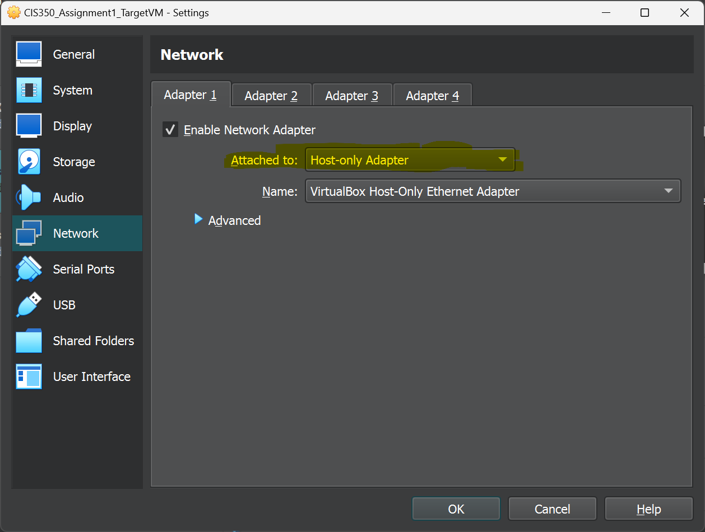

    ### UTM

    Right-click (two-finger click on trackpads) on the VM in the UTM list and choose "Edit". Find the "Network" settings, and choose "Host-Only" under Network Mode.

    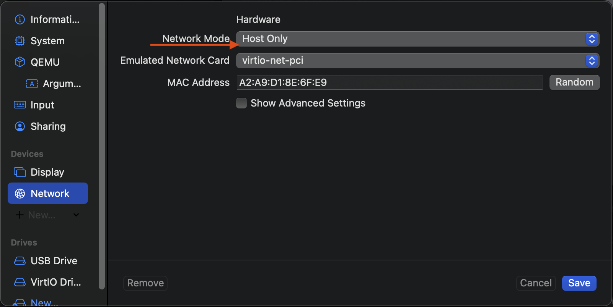

1. Start up the Target VM.

    If the VM starts successfully, you should see a screen similar to this:

    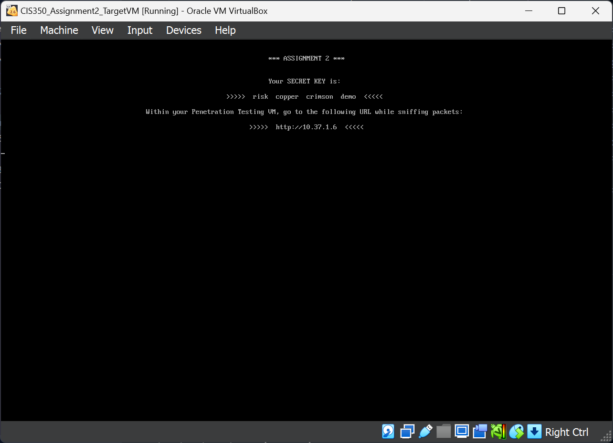

    **Take a screenshot of this screen**. The four code words on screen are required as part of your submission - not including these code words will result in significant loss of points.

1. Now, start up the PenTest Kali Linux VM.

    You are now ready to perform your packet sniffing exercise.

    > **Hint:**
    >
    > On VirtualBox, the default resolution for Kali is quite small (800x600). You may want to raise the resolution of the virtual machine so that you can fit more on the screen, especially if you have a large monitor or a high-resolution display.
    >
    > To do this, choose the Display Settings option.
    >
    > 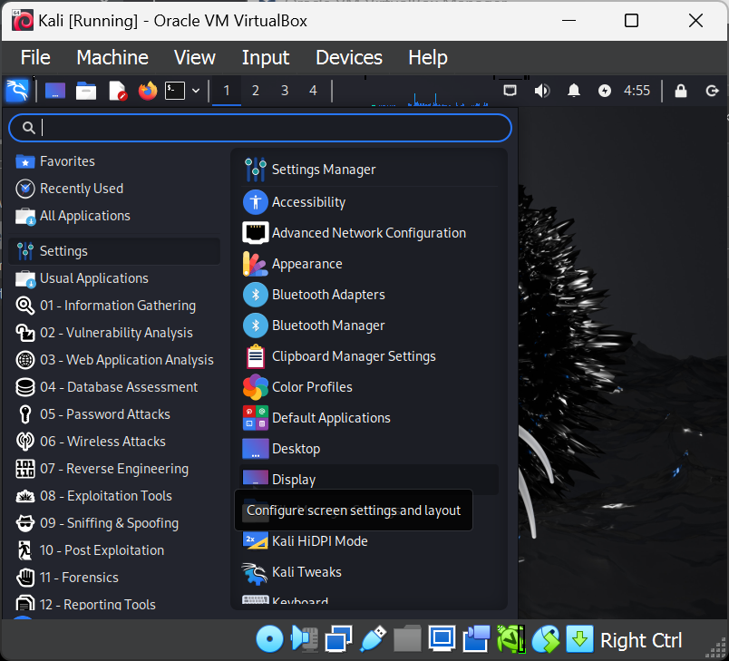
    >
    > Set the resolution to a higher value and then apply the settings.

1. Launch Wireshark on the Kali VM. It is found under the menu "09 Sniffing and Spoofing".

    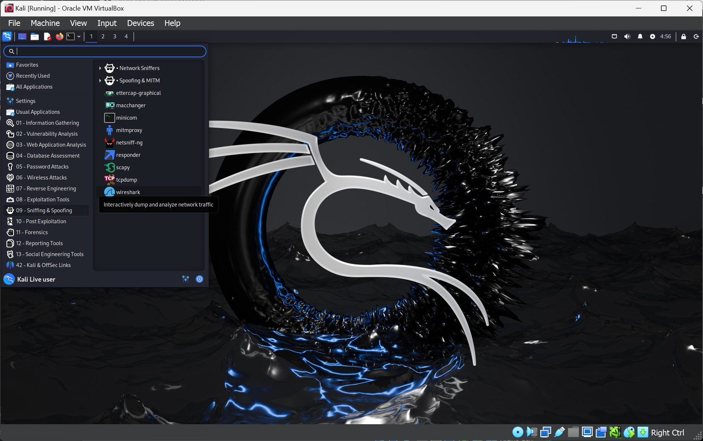

1. Also, open a Terminal window. It's the small square icon on the top bar.

    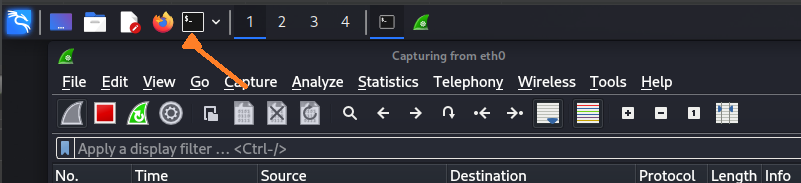

1. Start a packet capture in Wireshark. To do this quickly, just double-click the line that says "eth0". The Wireshark application should switch into a list view showing the captured packets.

    > You may see a random packet here and there, as the network layer in the Kali VM does things like probe the network for available routers. 

1. In the terminal, **ping the IP address of your target VM.** The IP address is displayed on the target's screen.

    Remember, the command for pinging is `ping <IP_address>`, **replacing `<IP_address>` with the IP address of the target VM.**

1. Take a look at the Wireshark window and notice the packets that were sent from your Kali VM to the target VM. You should see packets with the source as the IP of your Kali box and the destination as the target IP, with each packet immediately followed by a packet showing the reverse (source is target, destination is Kali). 

    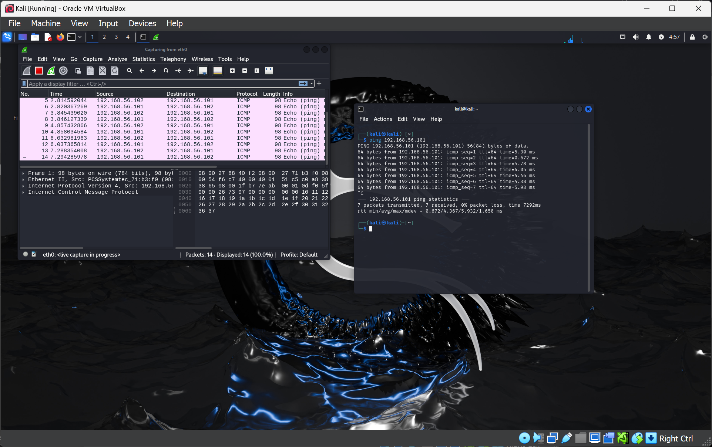

    **Take a screenshot of Wireshark** showing this. You can do this from outside the VM.

1. Now, open the Firefox browser. You'll see it on the top bar right next to the terminal icon.

1. Restart the capture to clear the Wireshark packet capture log. Under the Capture menu, choose Restart and choose not to save the capture log.

1. Now, in your browser window, visit the URL `http://<target_IP>`, again **replacing `<target_IP>` with the IP address of the target.** For example, if your target IP is `172.17.2.2`, you'd visit `http://172.17.2.2`. 

    Make sure you include the `https://` part of the address. If you put in only the IP address, Firefox will try to make a secure connection first. We're going to do that shortly, but first we want to see an *unencrypted* transmission so that we can view the packet log.

1. The browser should show the simple web page, and you should see some packets in the Wireshark window.

    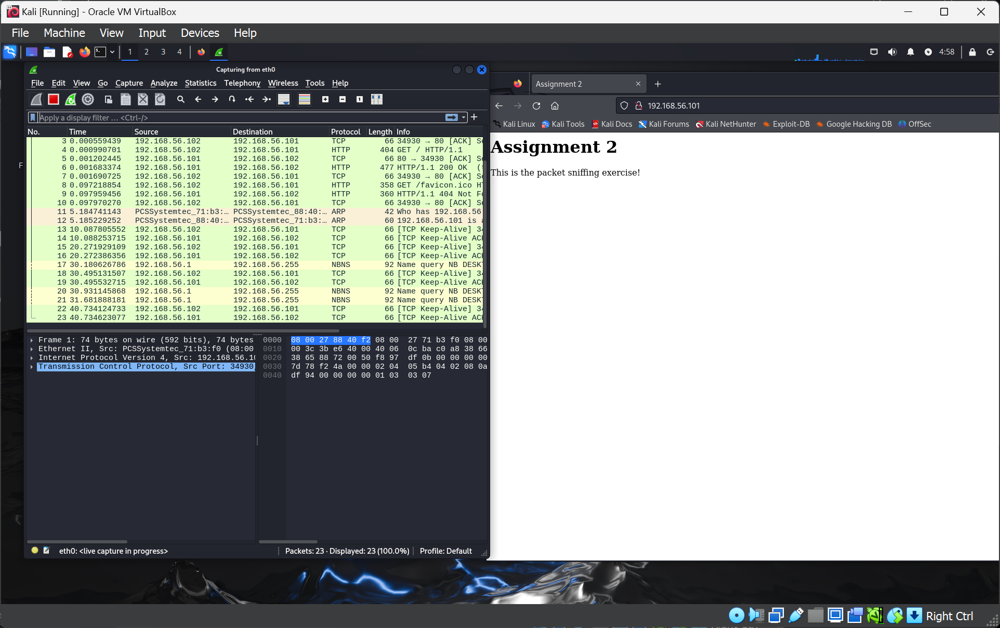

1. If you look in the packet list, you'll see some packets with the Protocol column labeled `HTTP`. These packets represent the actual connections your browser made to the target VM!

    Look for a packet where the Info field shows that it is a `GET` request for `/` - that is, the Info field should read `GET / HTTP/1.1`. You may need to scroll the packet list up and down a bit to find it. The packet should have the source IP of your Kali VM and the destination IP of the target VM.

    Immediately or very closely below this packet, you should also see a response packet that has an Info field reading `HTTP/1.1 200 OK`. It may occur a few packets down. **Click on this packet.**

    Now, in the bottom half of the Wireshark window, you'll be able to see the raw packet data as well as an analysis of the packet's contents. In this example, we can see that the packet is an Ethernet packet, transmitted using IP version 4, with TCP, coming from port 80 of the web server. The packet contains HyperText Transfer Protocol (HTTP) data. And if you scroll right a bit, you'll be able to see the *actual* raw data of the packet.

    If you know any HTML, you'll see some in here! 

    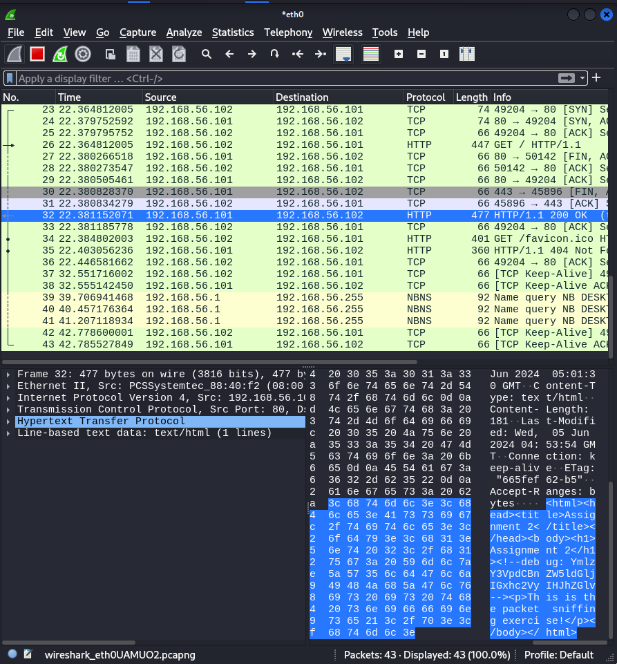

1. Now, *right click* on the packet you already selected, and choose Follow -> HTTP Stream.

    This option is the packet stream analysis option we talked about. This option tells Wireshark to analyze the entire sequence of packets that make up this HTTP connection.

    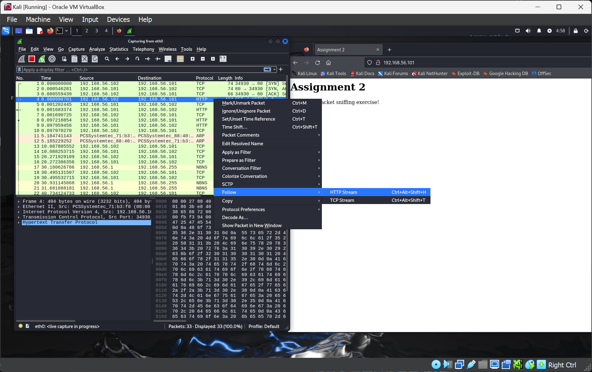

1. You should see a screen similar to the one shown below. Notice that this screen presents the data of the HTTP transmission a lot more cleanly. Here you can actually see both the HTTP protocol messages themselves (colored in red) and the actual HTTP payload data, in this case the HTML page (colored in blue).

    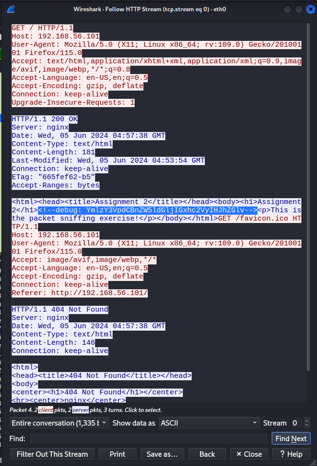

1. **Look within the HTML data for a section that looks like this: `<!--debug: SomeRandomCharactersHere-->`**. Note that `SomeRandomCharactersHere` will actaully be a set of random characters. **Highlight these characters and then take a screenshot**, as shown in the example above.

    These characters are an encrypted, encoded string that is cryptographically based on your code words. 

1. Close the window and go back to the packet capture window, and restart the capture to clear the view. 

1. Finally, we're going to do an HTTPS connection to the same server. In Firefox, visit `https://<target_IP>`. Firefox will warn you of an unverifiable SSL connection - this is fine because we are in a lab and testing environment, so you should choose to proceed anyway.

1. Now, look at Wireshark. You'll notice that instead of HTTP packets, we see `TLSv1.3` packets. TLS is the modern name for SSL, which is a protocol for sending encrypted data across the Internet. 

    SSL uses the Diffie-Hellman (DH) key exchange protocol to select and share a random symmetric key to use for an individual session. The DH exchange is designed in such a way that an eavesdropper cannot figure out that symmetric key even if it sees both ends of the negotiation phase. (Neat, huh?)

    If you select one of the TLS packets, you'll see that all of the data is encrypted and nonsensical:

    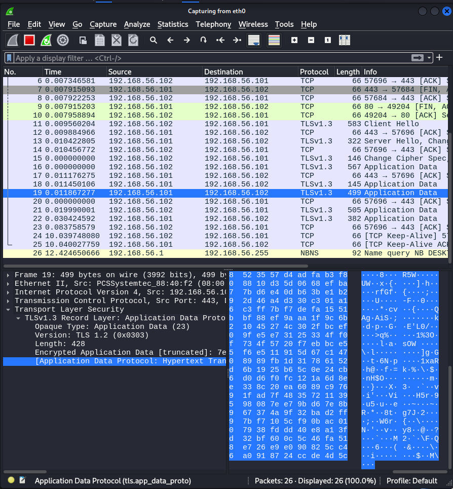

    We're no longer able to see the code words in the packet capture!

1. For the assignment, you will need *three* runs of unencrypted HTTP packet sniffing. Restart the target VM between each run and note the new code words each time before accessing the web page and running the packet sniff. 

    More details on actual submission are below.

## What We Learned

Packet sniffing is a powerful technique for analyzing the behavior of applications and the content of data they send across a network. Packet sniffing on its own is generally not considered an "attack" but would be more of a reconnaissance or enumeration task (depending on context). 

We saw that, with unencrypted standard HTTP (which was actually the norm until about a decade ago), it is possible to actually view the unencrypted contents of web communication.

Packet sniffing on your own computer, like we did here, is useful as a research tool. However, in an *attack* scenario, a hacker might use packet sniffing to try to *eavesdrop* or *intercept* traffic traversing a network. There are a few ways this can be accomplished, but as we can see, sending unencrypted data over the Internet is *dangerous* if there is any chance of the data being sniffed.

> It isn't always malicious actors who might be interested in packet sniffing. ISPs have been known to use sniffing as well as active packet modification to determine the type of content you are viewing and inject relevant advertisements into web pages that don't already contain them!
>
> Businesses also often use packet sniffing to detect unknown or misbehaving devices on their network, and historically also to monitor and control the types of content being accessed.

Today, nearly all Web traffic is transmitted using `https`, which as you see cannot be easily deciphered. Theoretical attacks do exist for TLS, but they require an enormous amount of computing power (and even then are not guaranteed to be successful). The shift to `https` was fueled very strongly by increasing awareness of packet sniffing and the potential risks it has.

> Businesses will use a *proxy server* on their network in order to continue to be able to monitor content. This requires special configuration on the clients accessing the Internet, so companies will often apply those configurations to company-owned computers. 
>
> It is perfectly legal for a company to sniff traffic on its own network for any purpose it desires. Therefore, a very strong piece of advice is to never do anything on a company-owned computer that you would not want that company knowing about. You are not guaranteed any privacy on a company network.
>
> Similarly, it is legal to sniff traffic on your own personally-owned home network, so you may wish to install Wireshark on your own computer outside the VM to experiment. You *should not* packet sniff on networks you don't own, such as the MSU campus network, networks at friends' houses, etc. Also, please practice ethical behavior and don't use packet sniffing to attack friends or family who may be connecting to your network when visiting!

## Submission

Your submission must include the following components:

* ***One*** screenshot of Wireshark showing packets indicating a successful ping and response from the target VM.
* ***One*** screenshot showing an *encrypted* `HTTPS` (TLSv1.3) transmission.
* ***Three*** screenshots, along with accompanying *code words* as printed on the target VM's display, that clearly show the `<!--debug: RandomString-->` text from the packet capture. Use the Follow->HTTP Stream option to display the page and highlight the above string, *starting at the `<!--` and ending after the `-->`. See the example above.

For convenience, you can name the three screenshots with the code words they represent. If you do not do this, you will need to include a document indicating which screenshot file matches with which code words. (You do not need to do this for the ping or HTTPS screenshots!)

This assignment will be due **Tuesday, June 11th** at **11:59 PM**.

## Scoring Rubric

This group project is worth 100 points:

| Item | Points | Penalties |
|-|-|-|
| Included a Wireshark screenshot showing a succesful ping between the Kali Linux and target VM | 15 | Partial point loss if the screenshot does not show a successful ping. Full point loss if screenshot missing. |
| Included **three (3)** Wireshark screenshots displaying an unencrypted HTTP connection to the target VM, with the random string including `<!--debug:` and `-->` **highlighted**, and appropriate documentation to indicate which code words were displayed on the target VM when the capture was taken. | 60 | Partial point loss if code words missing, proper text not highlighted, etc. Full point loss (20 points each) for missing examples. |
| Included one Wireshark screenshot showing an encrypted, unreadable TLSv1.3 connection to the target VM. | 15 | Partial point loss if the screenshot does not show the correct data. Full point loss if screenshot missing. |
| Proper procedures and practices followed | 10 | Point loss depends on specific infraction and severity. |

All group members will receive the same score, **unless one or more group members are found to not be contributing fairly.** If you have group members that are not responsive or not participating. **PLEASE LET ME KNOW.** Failure to report poor group member performance may have an impact on *your* grade!
