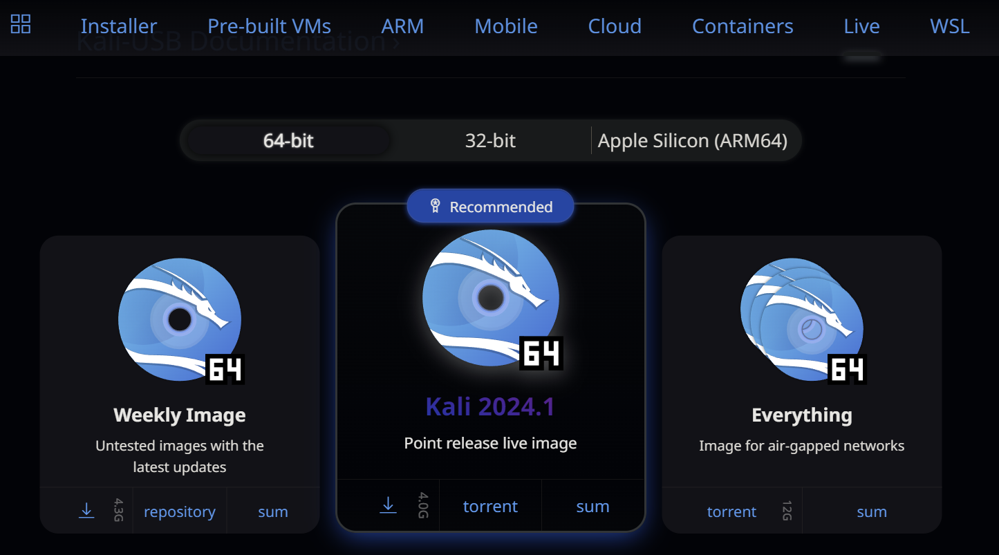
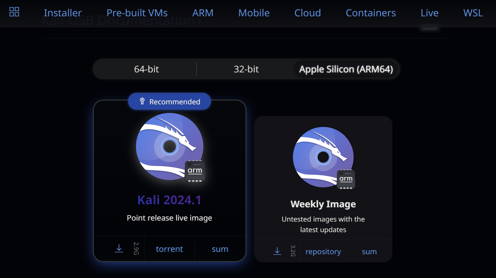
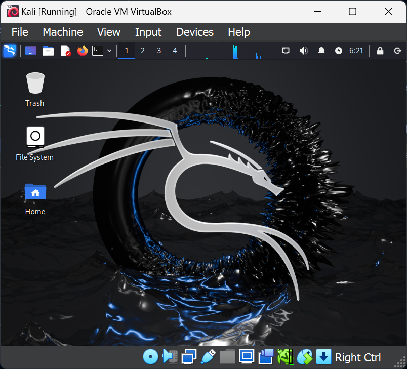
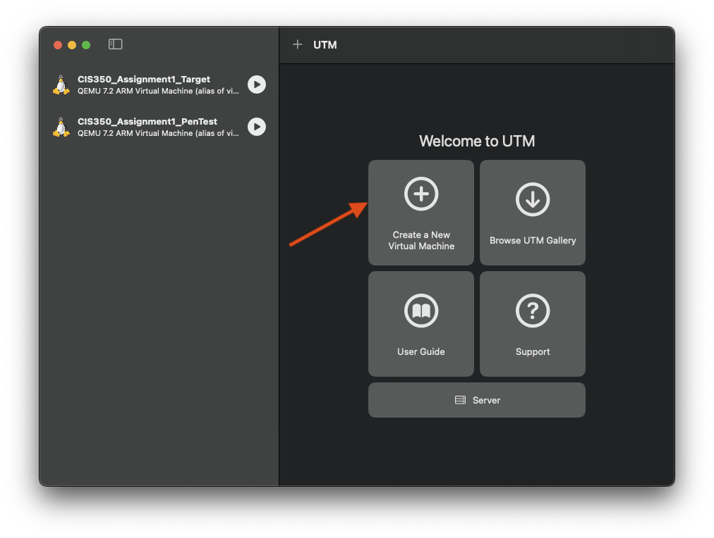
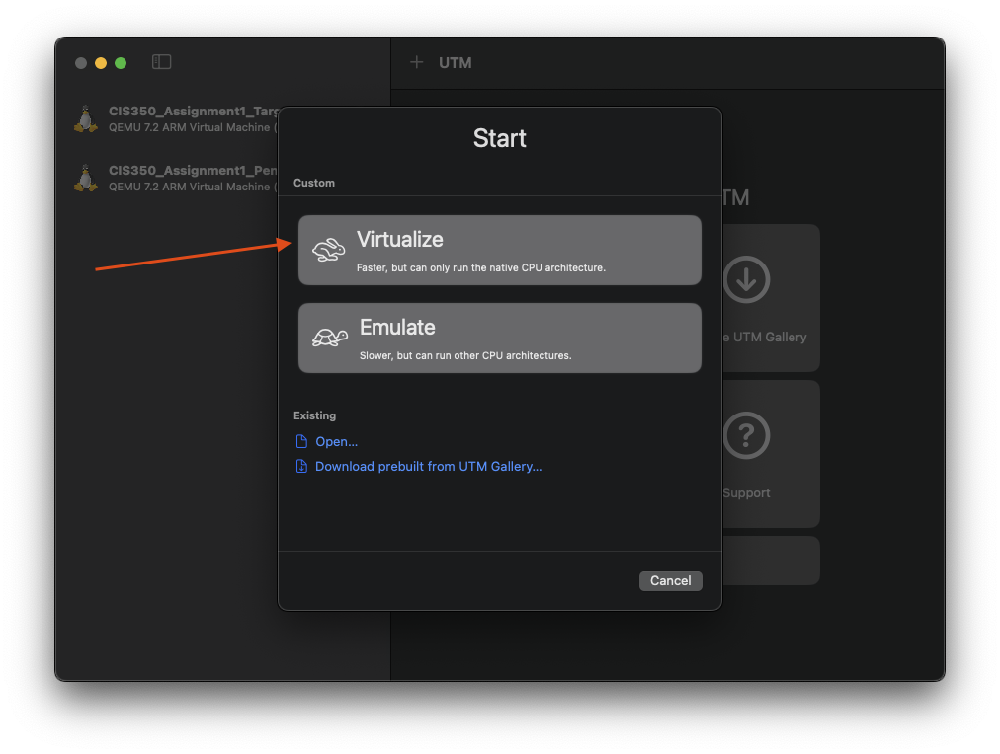
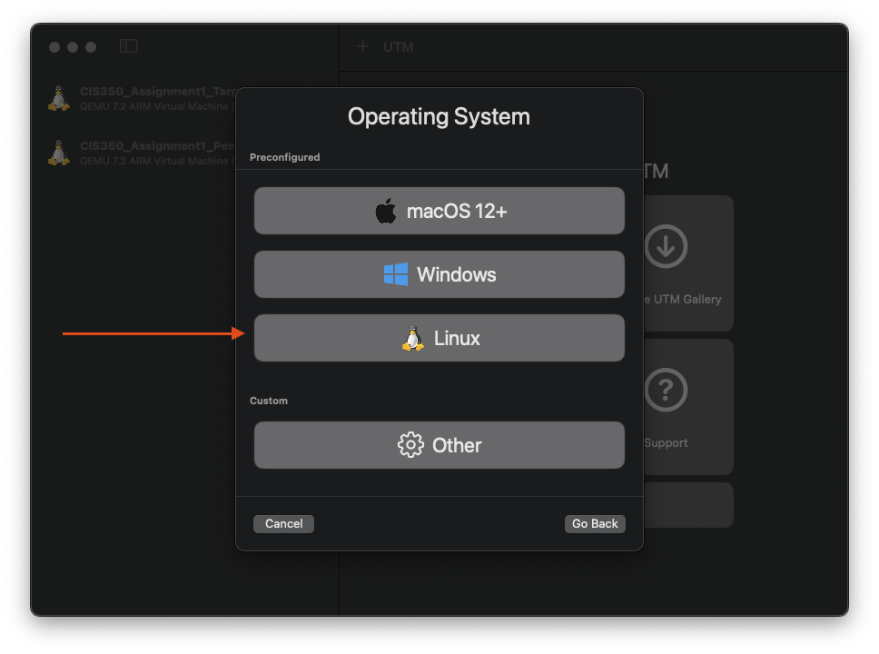
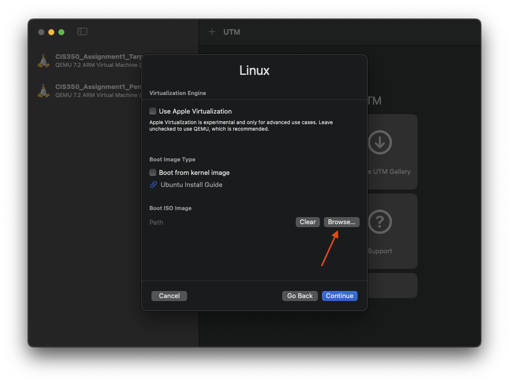
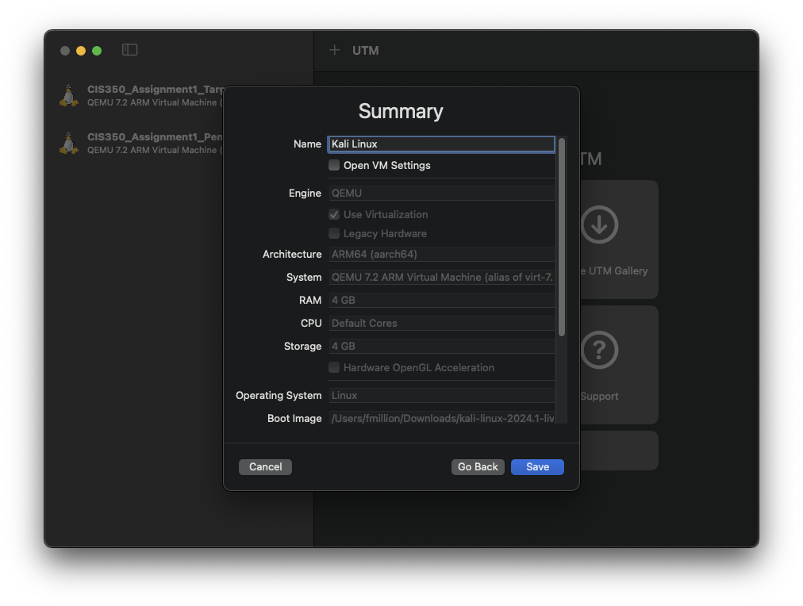
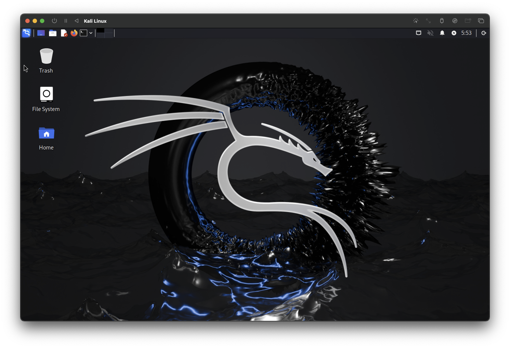

# Kali Linux

[Kali Linux](https://www.kali.org/) is a Linux version that is designed for cybersecurity professionals. It includes a wide range of tools used for penetration testing, security analysis, forensices and research. It is free and open source.

> NOTE: The default username for Kali Linux is `kali`, and the password is also `kali`. If you are ever prompted for a username and password when running Kali Linux, use this username and password.

## Get Kali

For CIS 350, you will not need to actually install Kali directly. Instead, you will use Kali in its "live" mode, in which you run it directly from the DVD ISO image. This is very much like what we did for the initial Ubuntu test. 

To download Kali, visit [the Kali Linux Download page](https://www.kali.org/get-kali/#kali-live). On this page, you'll see the option to get the current version (2024.1 as of this writing). 

* If you are on a Windows PC, you should download the "64-bit" version:

    

* If you are on an Apple Silicon Mac (M1, M2, M3, etc. processor - basically anything after 2020), you should first choose the Apple Silicon option.

    

Once you are on the correct page, just click the Download  icon to get your copy of Kali Linux.

> The image is rather large - around 4GB - so depending on your Internet connection, the download may take some time.

## Boot Kali

For projects in this course, you will use Kali as your "pentest" VM. (In assignment 1 you used a custom provided pentest VM - now you will use Kali as your pentest VM. You will still be provided with target VMs and instructions.)

Create a new virtual machine in your VM environment and configure it as a Linux virtual machine, specifying the ISO image you downloaded as the "install disc". 

> **Tip:** On VirtualBox, you can skip creating a hard drive completely, since you will not be storing any data on the Kali Linux VM. On UTM, the wizard forces you to create a hard drive, but it should not take up actual space on your system since you won't be installing Kali.

### VirtualBox

Using the Easy Wizard mode (default):

1. Create a new VM.
1. Enter a name for the VM, such as "Kali" or "PenTest". The name is up to you and does not matter for the assignment.
1. Select the downloaded ISO image for Kali.
1. **Check the box "Skip unattended installation".** VirtualBox will think it can "install" Linux from the ISO image, and since Kali Linux is based on the Debian Linux distribution, it will consider the disc a Debian disc and try to auto-install the distribution to a virtual drive. **You do not want this**, which is why you must check this box.
1. Click Next.
1. Give the virtual machine at least 2GB of memory. If you have enough system RAM, 4GB of memory will improve performance. 
1. Give the machine two CPU cores to improve performance.
1. Click Next.
1. **Choose the "Do not add a virtual disk" option**, and click Next.
1. Click Finish. Accept any "warnings" VirtualBox presents to you about not having a virtual hard drive.
1. Now, try to boot the VM to make sure it works.

    Press Enter at the boot selection screen to start up the desktop environment.
    
    > Kali is a comprehensive Linux distribution and booting it up may take some time. Be patient!

    If you are successful, you should see the Kali desktop screen in your VM:

    

1. **At this point, your Kali VM is probably connected to the Internet.** This is fine for now, since we aren't actually executing any attacks. However, **before you work on future assignments, you will need to move the Kali VM to the Local Only network!** Details will be in the instructions for each assignment.

### UTM

1. At the UTM main screen, choose Create a New Virtual Machine.

    

1. Choose "Virtualize".

    

1. Choose Linux as the OS.

    

1. Click the Browse button, and locate the downloaded Kali Linux ISO image.

    

    Make sure the name of the ISO contains the string `arm64`. If it contains `amd64` (note: they look very similar, so be careful!) then you downloaded the wrong image and should go back and download the Apple Silicon image.

1. Proceed through the rest of the setup and leave everything at the defaults.

    The default is to use 4GB of memory. This should be fine even on a small 8GB Mac, since the target VM will only use a small amount (about 512MB) of memory. However, if you run other services on your machine, you could lower the RAM usage to 2GB by entering `2048` as the memory size. Going much smaller than this will cause unstability and poor performance.

1. Once you reach the summary screen, name the VM.

    

1. Complete the wizard and then start up the VM.

    Press Enter at the boot selection screen to start up the desktop environment.

    If all is successful, you should reach the Kali Linux desktop.

    

### What's Next

You'll use Kali Linux in the final group assignments for the course. However, take some time to "poke around" and look at the wealth of tools and software available to you in Kali. The tools cover a wide variety of security testing, analysis and design scenarios, from reconnaissance (such as nmap) to packet sniffing (with Wireshark) to exploit testing (with Metasploit) and more. 

> Final reminder:
>
> Kali Linux is full of powerful tools that can get you in trouble if misused. Before you run any Kali tool against any computing system, make sure that you:
>
> * know what the tool does and what using it could do to the target
> * have permission to, or own, the computer(s)/network(s) you are targeting
> * practice ethical hacking standards and procedures

