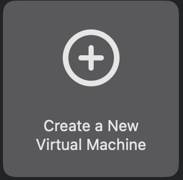
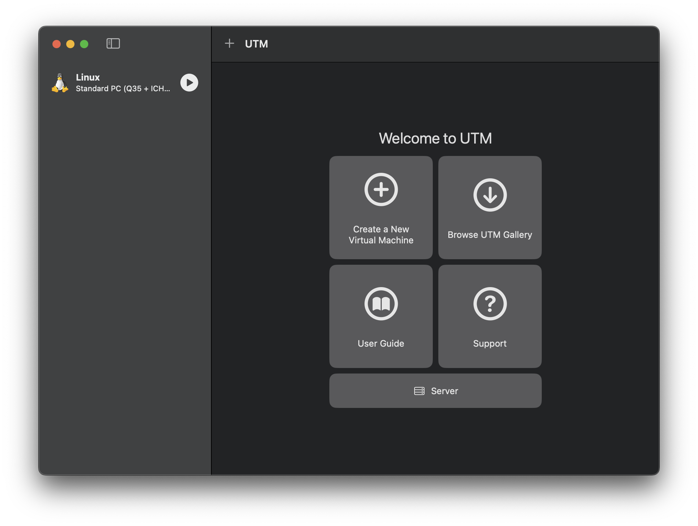
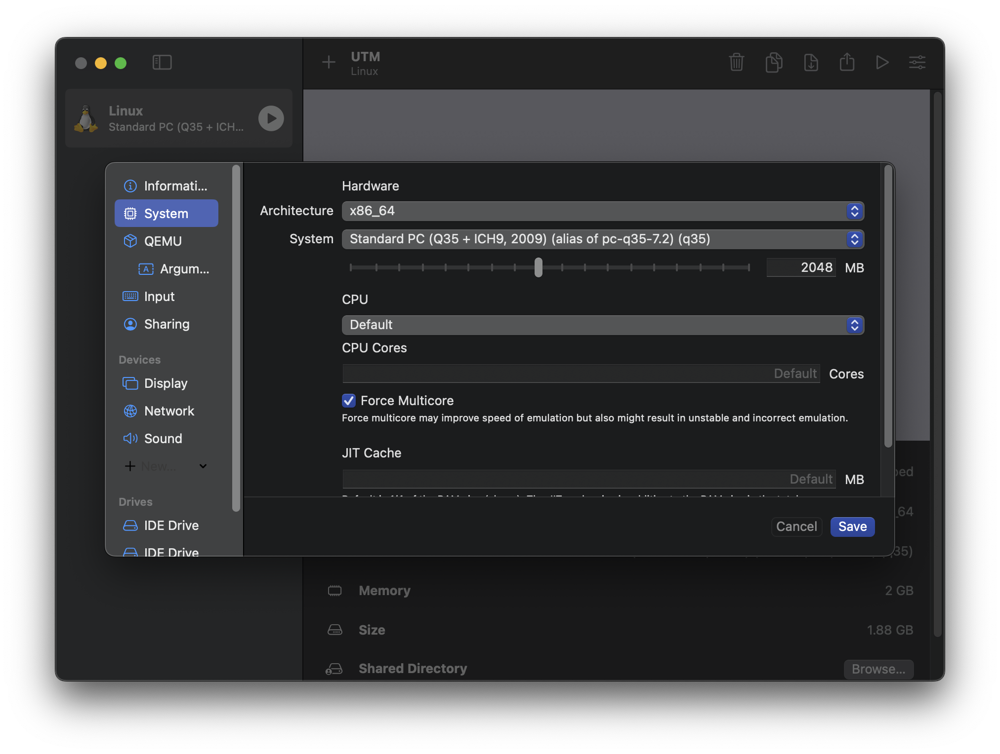

# Using UTM to run Virtual Machines on Macs with Apple Silicon processors

These instructions provide an alternative for Mac users who are using newer Apple Silicon machines.

UTM is a free open-source virtualization application for modern Macs. It can run virtual machines on Intel Macs similar to VirtualBox, but on ARM-based Macs (Apple Silicon Macs) it can run *both* ARM and Intel virtual machines. We can use UTM to run the Intel version of Ubuntu on an Apple Silicon Mac.

> UTM also runs on Intel-based Macs. Therefore, you can also choose to use UTM if you wish on an Intel Mac, however it is not necessary as VirtualBox is still fully supported on Intel.

> Apple Silicon Macs are Macs that have Apple "M" chips - such as the M1, M2, M2 Pro, etc. The first Apple Silicon Macs were released as follows:
>
> * MacBook Air, MacBook Pro and Mac mini: November 2020
> * iMac: April 2021
> * Mac Pro: June 2023
>
> If you purchased a *new* Mac after these dates, it's likely an Apple Silicon machine. 
>
> To find out what model chip you have, use About This Mac - if the "Chip" field displays anything like "Apple M1" or any other Apple M-series CPU, then you have an Apple Silicon Mac. If you see the word Intel, you're on an Intel Mac.

## Get UTM and Ubuntu

Visit <https://mac.getutm.app/> and download UTM. It will download as a disk image - mount the image and copy the application to the Applications folder. The install process is similar to many other Mac applications.

Download the desktop edition of Ubuntu from this site: <https://ubuntu.com/download/desktop>.

> If you're coming here after having tried with VirtualBox on your Mac, you may already have Ubuntu in your Downloads folder - you don't need to re-download it as long as you did not delete it.

## Setup a new VM with UTM

These instructions are equivalent to the VirtualBox instructions provided [here](VIRTUALBOX.md) but using UTM.

1. Launch the UTM application.
1. Choose the Create New VM option:

    

1. Choose the **Emulate** option. This is the option that lets you run Intel-based virtual machines on an Apple Silicon Mac:

    

1. Choose **Linux** as the OS.

    

1. On the next screen, use the Browse button and locate the Ubuntu ISO you downloaded. 

    Then click Continue.

1. On the next screen, set the RAM appropriately. If you're on a Mac with lower specifications (especially if you have only 8GB of RAM), change this to a lower amount, such as 2048MB (2GB). 

    Do not change other options on this screen.

    Click Continue.

1. UTM requires you to create a hard disk image, so you cannot use the "don't create a disk" option like you can with VirtualBox. This is OK however, as disk images in UTM only take up space once you put files on them - so you do not need to worry about the virtual hard drive taking up space. You can leave the default setting.

    Click Continue.

1. The next screen is designed to let you share files from your host Mac into the VM. We will not be using this feature, so you can skip this screen.

    Click Continue.

1. On the final screen, enter a name for your VM. It will likely default to "Linux", which you can leave for testing purposes.

    Click Save.

    If all went well, you should now see the main UTM screen along with the VM you created:

    

1. Click on the Play icon for the VM you just created.

    You should see a window appear, and from this point you can work just as you would have with VirtualBox. If the VM was configured successfully, you should eventually arrive at an Ubuntu desktop screen.

    During the boot process, you may see the message "Display output is not active". If you see this, hang on - the VM is booting up and the display will go "blank" for some time. You can expect the bootup to take some time - the emulation layer for running Intel code on Mac is fast, but not *that* fast. Be patient - it may take up to 10 minutes to fully load.

    > The VMs we use for class won't be this bad. I'll have ARM-based VMs available for the parts of the assignments that can use them, and the Intel VMs - typically the ones you will be attacking - won't need a graphical interface, making them faster.

    > If you are sitting at a black screen with an "X" cursor and have been waiting for a very long time (over 10 minutes), you may need to force multiprocessor support. 
    >
    > * Power off your VM by going to the UTM main window, right-clicking the VM and choosing Stop.
    > * Right-click the VM and choose Edit to access settings.
    > * Under "System", check "Force Multicore".
    > 
    >     
    >
    > * Click Save, and then try starting the VM again.

    If all went well you should end up here:

    

Congratulations - you have a working VM environment!
