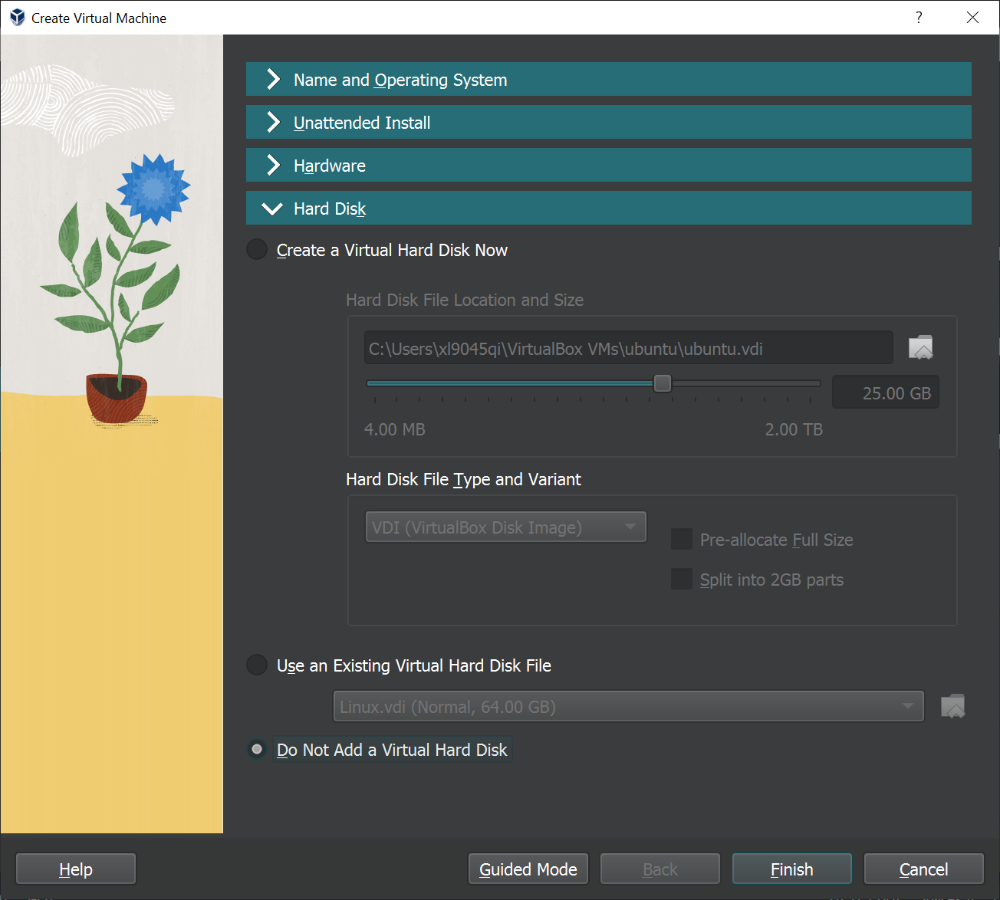

# Setting up and testing VirtualBox

These are the steps we discussed in class for setting up and testing VirtualBox on your computer.

1. Visit <https://www.virtualbox.org/wiki/Downloads> to visit the download page for VirtualBox.
1. Download the correct version for your computer:
    * If you are on a **Windows PC**, you want the version for Windows hosts.
    * If you are using an **older Intel-based Mac**, you can download the macOS Intel version.
    * If you are on a newer **Apple Silicon (M1 etc) based Mac**, you need to visit the Older Builds page (<https://www.virtualbox.org/wiki/Download_Old_Builds_7_0>) to get the latest Developer Preview version for Apple Silicon Macs. Scroll down to **VirtualBox 7.0.8** and get the version labeled "Developer Preview for macOS / Arm64 (M1/M2) hosts".
1. Install the application as you would any typical app.
1. Download the latest Ubuntu desktop version ISO image from <https://ubuntu.com/download/desktop>. It is a somewhat large download (about 6 GB), so if you have a slow connection, go ahead and grab a snack while you wait.
1. Start VirtualBox and **create a new virtual machine**.

    

1. Set up the new VM by entering a name for the VM.
1. Select the ISO image you downloaded under the ISO Image section.
1. Check the "Skip Unattended Installation" check box.

    Your first screen should look like this:

    

1. Switch to the Hardware section. Set the RAM memory to at least 2,048 MB (2GB). If you have enough RAM in your PC you can increase this. However, I recommend you keep the total of RAM for all VMs you are running at the same time to about half of your total system RAM. 
1. Set the number of CPU cores. By default, only a single core is allocated. If you have more cores, you can allocate more cores to the VM to get a performance increase.

    The Hardware screen looks like this:

    

1. Switch to the Hard Disk tab. For the purposes of this test, simply choose "Do not add a virtual hard disk". 

    

    We will not actually be *installing* Linux, we will only be running the live version for testing. However, if you are curious and interested, you can choose to create a hard disk image and install Linux if you want to!

1. Choose "Finish" to complete creating the new virtual machine.
1. Make sure your new VM is selected on the left panel, and then click Start.

    

1. If all goes well, you will see the Ubuntu desktop environment inside of your virtual machine window!

    

    > **Important Tip:** When working with VirtualBox, you will use the Host Key to switch between your normal desktop and your virtual machine. On Windows this should default to **Right Control** and on Mac to **Left Command**, but you can change the Host key if you wish in VirtualBox's Settings. You can also see what your host key is as it is printed on the status bar of the VM window.

If you are unable to get VirtualBox to run, please contact me so we can make alternative arrangements.

