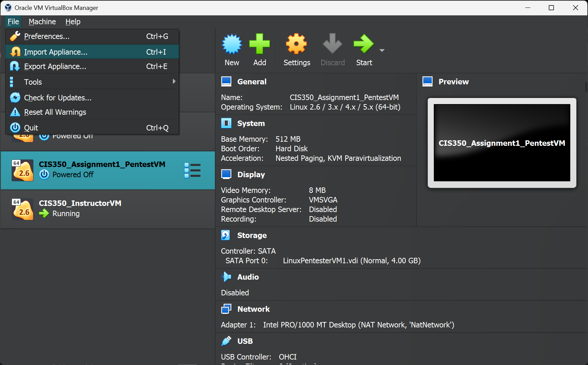
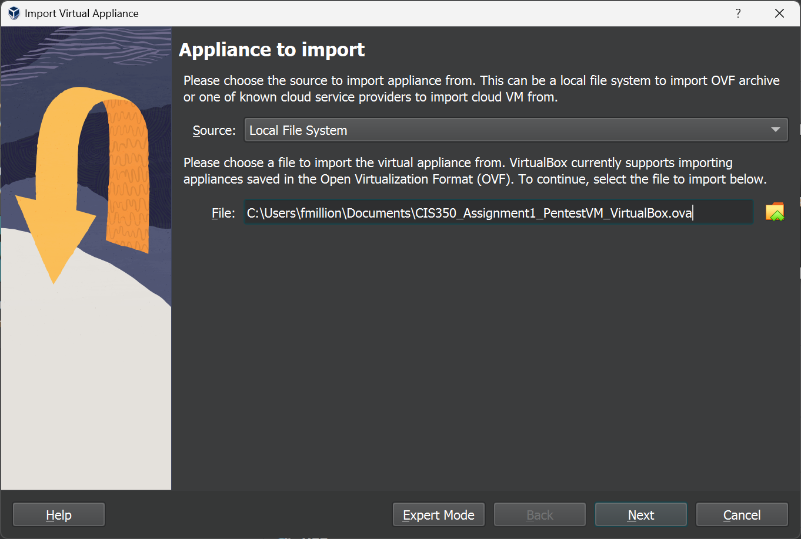

# How to import virtual machines for CIS 350 projects

Virtual machines for class projects are offered in two formats:

* `.ova` (Open Virtual Appliance) format for use with VirtualBox on Windows and Intel-based Macs
* `.utm` format for use with UTM on ARM (Apple Silicon M1/M2/etc.) Macs

This document describes the steps for importing a virtual machine into your virtual machine environment for course projects.

## VirtualBox

1. Download the `.ova` file from D2L or from the link given.

1. In the main VirtualBox window, open the File menu and choose "Import Appliance."

    

1. Click the folder with the green up arrow and locate the `.ova` file you downloaded.

    

1. Click Next.

1. On the "Appliance Settings" screen - **very important** - choose the option "Generate new MAC addresses..." under "MAC Address Policy". Failing to do this could potentially cause conflicts on your machine between virtual machines.

1. Click Finish, and the virtual machine should be available for you to configure and start.

## UTM

